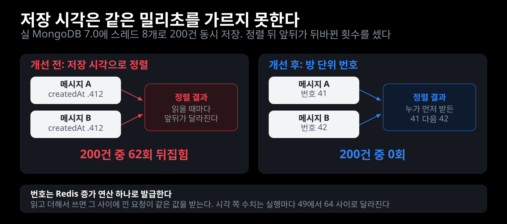
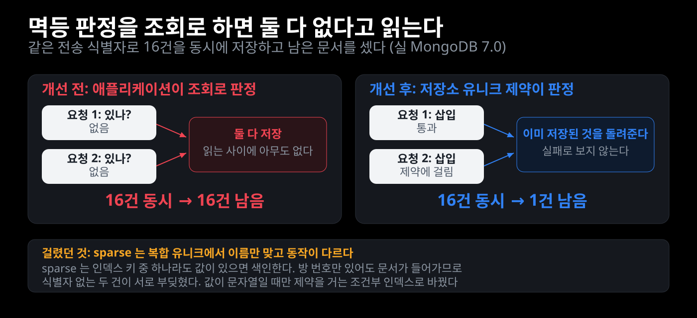
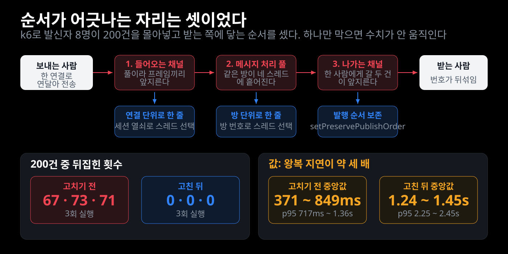
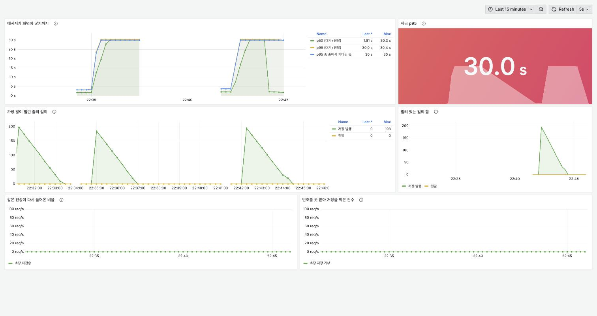

# 빌려조잉 리팩토링 기록

팀 프로젝트가 끝난 뒤 내가 맡았던 모듈을 다시 열어 고친 기록이다. 고치기 전에 무엇이 어떻게 돌고 있었는지를 먼저 적고, 무엇을 포기하고 무엇을 얻기로 했는지, 고친 뒤 무엇이 달라졌는지를 잰 값으로 남긴다.

## 사실

| | |
|---|---|
| 기간 | 2025-10-20 ~ 2025-11-19 (커밋 기준) |
| 팀 | 6명 (프론트 2, 백엔드 4) |
| 내가 맡은 것 | 회원 인증, 실시간 채팅, 계좌 인증과 금융망 연동 |
| 다른 사람이 맡은 것 | 상품·게시글·검색, 토스페이먼츠 결제와 에스크로 상태 관리, 대여 이력 |
| 수상 | 삼성전자 우수상 (6인 팀) |

모듈별 라인 소유권은 `git blame` 기준이다.

| 패키지 | 내 라인 / 전체 | |
|---|---|---|
| `chat` | 5,451 / 5,456 | 실시간 채팅 |
| `account` | 1,826 / 1,872 | 계좌 등록, 1원 인증 |
| `ssafy` | 1,216 / 1,411 | 금융망 API 클라이언트 |
| `auth` | 746 / 746 | 인증 |
| `member` | 745 / 795 | 회원 |

`payment`와 `escrow`는 다른 팀원이 만들었고, 내가 만든 금융망 층을 호출한다. 경계는 `PaymentService.java:402`의 `financeApiService.depositMoney(...)` 한 줄이다.

## 어디서 시작했는가

다시 열어 보고 알게 된 것은 필요한 조각이 없다는 게 아니라, **만들어 두고 잇지 않았다**는 것이었다. 네 군데에서 같은 모양이었다.

| 만들어 둔 것 | 무엇에 쓰려던 것 | 실제 |
|---|---|---|
| `inquireTransactionHistory` | 거래고유번호로 송금 결과 재조회 | 호출자가 계좌 조회 화면뿐 |
| `getMessagesAfter` | 재접속 시 놓친 메시지 복구 | 호출자 없음 |
| `MongoConfig`의 인덱스 생성 | 안읽음 집계와 커서 페이징 | 컬렉션 이름이 달라 안 붙음 |
| `outbox` | 이벤트 재발행 | 결제 경로가 쓰지 않음 |

여기에 하나가 더 있었는데, 이것은 잇지 않은 것이 아니라 이을 수 없게 막혀 있던 것이었다. `.gitignore`의 `test/` 한 줄이 이름이 `test`인 디렉터리를 전부 무시해 `backend/src/test`까지 같이 무시했다. Vue 템플릿에서 따라온 규칙이고 주석에도 출처를 모르겠다고 적혀 있다. **테스트를 써도 커밋되지 않는 상태였다.** 유일하게 추적되던 테스트 하나는 그 규칙이 들어오기 전에 들어간 것이고, 그마저 참조하는 클래스가 없어 컴파일되지 않았다. 둘이 겹쳐 아무도 눈치채지 못했다.

마감에 맞춰 돌아가게 만드는 데까지 갔고, 그 뒤를 잇지 않은 채로 끝난 것이다.

---

## 상황 1. 돈이 실제로 나가는 호출에만 타임아웃이 없었다

**같은 프로젝트 안에서 외부 호출이 둘이다. 토스페이먼츠 결제 승인은 연결 5초, 읽기 10초로 묶여 있었다. 금융망 송금은 아무 제한이 없었다. 제한이 없는 쪽이 실제로 계좌 사이에 돈을 옮기는 쪽이다.**

### 문제 인식

`FinanceApiService`가 던지는 예외가 호출부에서 어떻게 읽히는지를 따라가니 여섯 개가 한 줄로 이어져 있었다.

```
1  new RestTemplate()               읽기 타임아웃 무제한
2  catch (Exception)                타임아웃을 INTERNAL_SERVER_ERROR 하나로 접는다
3  호출부 catch (Exception)          답이 없는 것을 실패로 확정하고 토스 결제를 취소한다
4  취소도 실패                       log.error 한 줄. "수동 처리 필요"라고 적혀 있다
5  PaymentStatus                    READY / DONE / CANCELED / FAILED. 미확정 자리가 없다
6  outbox                           프로젝트에 있는데 이 경로가 쓰지 않는다
```

호출부는 이렇게 되어 있다.

```java
// PaymentService.java:396~430
try {
    String txNo = financeApiService.depositMoney(escrowAccountNo, totalAmount, ...);
} catch (Exception e) {
    // Toss 결제는 이미 승인되었으므로, 보상 트랜잭션으로 취소 시도
    try {
        tossClient.cancel(tossResponse.getPaymentKey(), "에스크로 계좌 입금 실패");
    } catch (Exception cancelEx) {
        log.error("[Toss 결제 취소 실패 - 수동 처리 필요] orderId={}, ...");
    }
    throw new IllegalStateException("에스크로 계좌 입금에 실패했습니다", e);
}
```

보상 트랜잭션 자체는 맞는 방향이다. 문제는 **무엇을 보상해야 하는지 판정하는 근거**다. 금융망 호출이 타임아웃 나면 입금이 됐는지 안 됐는지 모르는데, 지금 코드는 그것을 실패로 읽고 이미 승인된 토스 결제를 취소한다. 입금이 실제로 성공했다면 고객 돈은 돌아가고 에스크로 계좌에는 돈이 남는다. 취소마저 실패하면 그 사실이 로그 말고는 어디에도 남지 않고, 다시 시도할 경로도 없다.

### 대안 비교

응답이 오지 않았을 때 그것을 무엇으로 적을지가 갈렸다.

- **① 실패로 확정하고 토스 결제를 되돌린다.** 상태가 하나 줄어 가장 단순하다. 되돌리기가 항상 성공한다면 이 단순함이 맞다. 그런데 되돌리기도 외부 호출이라 실패할 수 있고, 지금 코드에서 되돌리기가 실패하면 남는 것이 로그 한 줄뿐이다.
- **② 성공으로 보고 진행한다.** 사용자 흐름이 안 끊긴다. 입금이 실제로 안 됐으면 에스크로 계좌에 없는 돈을 있다고 적게 되고, 그 차이는 정산할 때 드러난다.
- **③ 모른다를 상태로 남긴다.** 지금 답을 확정하는 것을 포기하는 대신 장부가 틀리지 않는 것을 얻는다. 대신 미확정 건을 찾아 확정하는 일이 늘어난다.

**③을 골랐다.** 되돌리기가 외부 호출이라 실패할 수 있고, 실패했을 때 갈 데가 없다는 것이 ①을 버린 이유다.

### 핵심 판단

- **확정은 금융망이 확정해 준 것만 한다.** 헤더 응답 코드가 `H0000`일 때만 성공이고, 응답을 못 읽으면 미확정이다. `H0000`이 아닌 코드 안에도 성격이 다른 것이 섞여 있을 수 있으나 코드별 분류는 아직 하지 않았고, 그때까지는 전부 확정 실패로 둔다.
- **연결 타임아웃과 읽기 타임아웃을 가르지 않았다.** 가르면 연결 단계에서 끊긴 건을 "보내지도 않았다"로 확정할 수 있어 재조회를 아낄 수 있다. 그런데 클라이언트 구현에 따라 두 타임아웃이 같은 예외로 올라와 안전하게 가를 수 없다. 미확정으로 잘못 분류하면 재조회 한 번이 더 들고, 확정 실패로 잘못 분류하면 이미 옮겨진 돈을 장부에서 지운다. 틀렸을 때의 값이 한쪽으로 크게 기울어 있어 전부 미확정으로 뒀다.
- **성공 코드가 왔는데 거래고유번호가 없으면 미확정으로 둔다.** 나중에 이 건을 다시 물을 열쇠가 없으면 확정할 근거도 없다.
- **미확정일 때 예외를 던지지 않는다.** 던지면 트랜잭션이 롤백돼 방금 남긴 미확정 기록까지 같이 사라진다. 그러면 이 건을 찾을 방법이 없어져 처음 문제로 돌아간다.
- **타임아웃 값은 설정으로 뺐다.** 상대 서버의 응답 분포는 환경마다 다르고, 값을 조정하려고 배포를 다시 하지 않기 위해서다.
- **세 변경을 한 번에 넣었다.** 타임아웃만 먼저 넣으면 지금까지 무한정 기다리던 호출이 빠르게 실패하면서, 답이 없는 건을 실패로 확정하고 결제를 되돌리는 기존 경로로 더 자주 들어간다. 타임아웃은 그 시간이 지났을 때 무엇으로 볼지가 정해져 있어야 안전하다.

### 해결

| 자리 | 전 | 후 |
|---|---|---|
| 금융망 클라이언트 | `new RestTemplate()`, 제한 없음 | 연결 2초, 읽기 5초. 설정으로 조정 |
| `depositMoney` 반환 | `String`. 실패는 전부 같은 예외 | `TransferOutcome` 셋 — 성공, 거절, 미확정 |
| 응답 판정 | `H0000`이 아니면 실패 | `H0000`만 성공. 읽을 수 없는 응답은 미확정 |
| 거래고유번호 | 로그에만 남음 | `escrow.deposit_tx_no`에 저장. 재조회의 열쇠 |
| 에스크로 최초 상태 | `HELD` (입금 전인데 예치 완료) | `PENDING` → 입금이 확정되면 `HELD` |
| 미확정일 때 | 토스 결제 취소 후 롤백 | 되돌리지 않고 `PENDING`으로 남긴다 |
| 거절일 때 | 위와 같음 | 토스 결제 취소. 돈이 안 옮겨진 것이 확정이므로 되돌리는 것이 맞다 |

`Status.PENDING`은 원래 선언만 되고 쓰이지 않던 값이다. 새로 만들지 않고 그 자리를 썼다.

### 실측

판정과 재개 규칙을 테스트로 고정했다. 저장소에 테스트가 하나도 없었고 그 하나마저 컴파일되지 않아서, 빠진 클래스를 먼저 만들어 살린 뒤 붙였다.

| 무엇을 고정했나 | 테스트 |
|---|---|
| 응답 코드가 `H0000`이고 거래고유번호가 있을 때만 성공 | 9개 (`FinanceApiServiceDepositTest`) |
| 읽기 타임아웃, 빈 응답, 모양을 모르는 응답은 전부 미확정 | 위와 같음 |
| 4xx와 `H0000`이 아닌 코드는 확정 실패 | 위와 같음 |
| 확정된 송금은 거래고유번호가 남고 다시 보내지 않는다 | 4개 (`EscrowSettlementResumeTest`) |
| 조회 실패를 거래 없음으로 읽지 않는다 | 4개 (`EscrowDepositRecoveryTest`) |
| 못 찾은 건을 실패로 확정하지 않는다 | 위와 같음 |

아직 재지 않은 것은 실제 금융망에 붙여 보는 것이다. 목록 조회(`inquireTransactionHistoryList`)는 기존 단건 조회의 요청·응답 모양을 따라 만들었고, 실 API에 대고 확인하지 않았다.

### 이 작업 중에 드러난 것

에스크로를 만드는 살아 있는 경로가 둘이다.

| 경로 | 금융망 입금 | 만드는 상태 |
|---|---|---|
| `PaymentService` (결제 승인 직후, 동기) | 한다 | `PENDING` → `HELD` |
| `OutboxEventProcessor` (웹훅 → 아웃박스, 비동기) | 하지 않는다 | `HELD` |

둘 다 `findByPayment_PaymentId`로 중복 생성을 막는다. 그래서 **웹훅이 먼저 도착하면 아웃박스 쪽이 `HELD`로 먼저 만들고, 결제 쪽의 입금 블록이 통째로 건너뛰어진다.** 기록은 예치 완료인데 에스크로 계좌에는 돈이 들어가지 않는다. 아직 재현하지 않았고, 어느 쪽이 입금을 책임질지도 정하지 않았다. 이번 변경에서는 두 경로의 동작을 그대로 두고 사실만 적어 둔다.

---

## 상황 2. 제거했다고 적어 둔 브로커가 아직 살아 있었다

**`WebSocketConfig`에는 SimpleBroker를 제거하고 Redis Pub/Sub으로 대체했다고 적혀 있다. 그런데 코드에는 브로커를 켜는 호출이 없다. 둘 다 없으면 Spring이 SimpleBroker를 자동으로 켠다. 브로커는 그대로 살아 있었고, 바뀐 것은 목적지 접두사 제한이 사라진 것뿐이었다.**

### 문제 인식

주석을 믿고 넘어갈 뻔했다. `enableSimpleBroker` 호출을 찾으니 주석 처리된 한 줄밖에 없었다.

```
WebSocketConfig.kt:47   // - 기존: registry.enableSimpleBroker("/topic", "/queue")
grep enableSimpleBroker → 그 주석 말고 호출 0건
```

정말 제거됐다면 지금 이 목적지들이 전부 죽어 있어야 한다.

| 무엇 | 어디로 나가나 |
|---|---|
| 채팅 메시지 본문 | Redis Pub/Sub |
| 타이핑, 읽음 | `convertAndSend("/topic/chat/{id}/...")` 로컬 브로커 |
| 접속 상태, 안읽음 배지, 방 상태 변경 | `convertAndSendToUser(...)` 로컬 브로커 |

즉 서버를 늘리면 메시지 본문만 건너가고 나머지 실시간 신호는 발신 서버 안에 갇힌다.

### 핵심 판단

- **주석 대신 실행으로 확인했다.** 브로커를 켜는 호출 없이 설정만 흉내 낸 뒤 Spring이 SimpleBroker를 만드는지 직접 물었다.
- **음성 결과에는 양성 대조를 붙였다.** "다른 서버에는 안 닿는다"만 재면 설정이 잘못돼도 통과한다. 한 대 안에서는 닿는다를 같은 방식으로 재서 대조군으로 뒀다. 실제로 이 대조군 덕분에 처음 만든 실험 장치가 틀렸다는 것을 알았고, 브로커가 CONNECT 응답까지 같은 채널로 보내 전달된 것처럼 세고 있던 것도 찾았다.
- **재현한 것이 무엇인지 좁혀서 적는다.** 서버 두 대를 실제로 띄운 것이 아니라 브로커를 두 개 만들어 각각을 한 대로 삼았다. 전달 구조는 같지만 배포된 두 노드에서 다시 재는 것은 아직 하지 않았다.

### 해결

| 자리 | 전 | 후 |
|---|---|---|
| Mongo 인덱스 대상 | 문자열 `"chatMessages"` | 엔티티에서 컬렉션 이름을 받는다 |
| 인덱스 초기화 | 기동할 때마다 전부 지우고 다시 만든다 | 없을 때만 만든다 |
| 성능 주석 | 재지 않은 `500ms → 5ms` | 지웠다 |

브로커 자체는 아직 손대지 않았다. 로컬 브로커로 나가는 목적지를 Redis로 옮기는 것은 상황 3으로 따로 연다.

### 실측

| 무엇을 고정했나 | 결과 |
|---|---|
| 브로커를 켜는 호출이 없어도 SimpleBroker가 만들어진다 | 확인 |
| 자동으로 켜진 브로커에는 목적지 접두사 제한이 없다 | 확인 |
| 한 대 안에서는 타이핑이 닿는다 (대조군) | 닿는다 |
| 다른 서버에 붙은 구독자에게는 닿지 않는다 | 1초 안에 오지 않는다 |
| 메시지 본문은 Redis Pub/Sub으로 건너간다 | 5초 안에 도착 |
| 인덱스가 `@Document`가 가리키는 컬렉션에 붙는다 | 확인 |
| 컬렉션 이름을 문자열로 적으면 예외 없이 다른 컬렉션에 만들어진다 | 재현됨 |

`chat` 테스트 7개다. Mongo와 Redis는 컨테이너로 띄워 실제로 붙였다.

---

## 상황 3. 붙을 수 없게 된 외부 API를 안으로 들였다

**돈을 옮기던 SSAFY 금융망 교육용 API에 더 이상 붙을 수 없다. 상황 1에서 고친 것이 전부 이 API를 부르는 자리였다. 부를 곳이 없어졌으니 그 경계를 어디에 다시 그을지 정해야 했다.**

### 대안 비교

- **① 다른 외부 결제망으로 갈아 끼운다.** 원래 하려던 것에 가장 가깝고 실제 계좌 사이에 돈이 오가는 것을 유지한다. 개인 프로젝트에서 실 정산망에 붙는 것은 계약이 필요하고, 붙는다 해도 이 저장소를 열어 보는 사람이 그 동작을 재현할 수 없다.
- **② 금융망을 흉내 내는 서버를 세운다.** 코드를 하나도 바꾸지 않아도 된다. 그런데 흉내 낸 서버는 내가 정한 대로만 답하므로, 그 위에서 잰 값은 내가 가정한 것을 다시 확인한 것에 지나지 않는다.
- **③ 경계를 안으로 들여 내부 원장으로 만든다.** 밖으로 나가는 호출이 없어지므로 돈이 옮겨졌는지 모르는 상태가 생기지 않는다. 대신 잔액과 원장을 직접 지켜야 하고, 실제 은행 계좌로 빼는 일은 못 하게 된다.

**③을 골랐다.** 재현할 수 있는 것을 남기는 쪽이 낫다고 봤다. 저장소를 받아 도커만 띄우면 이체가 실제로 도는 것을 확인할 수 있다.

### 핵심 판단

- **포트를 먼저 뽑고 구현을 갈았다.** 결제와 정산과 환불은 돈이 어디를 거쳐 옮겨지는지 몰라도 되고 확정됐는지 거절됐는지만 알면 된다. 그 셋을 돌려주는 포트에만 의존하게 하고, 금융망 구현은 지우지 않고 설정으로만 켜지게 남겼다.
- **잔액을 읽고 고쳐 저장하지 않는다.** 동시에 들어온 두 이체가 같은 잔액을 읽고 각자 빼서 저장하면 한쪽이 사라지고, 잔액이 음수로 내려가는 것도 그렇게 생긴다. 조건을 WHERE에 넣어 DB가 한 번에 판정하게 했다.
- **멱등 판정을 애플리케이션 조회가 아니라 DB 제약에 맡겼다.** 조회로 확인하면 동시에 들어온 두 요청이 둘 다 없다고 읽고 둘 다 넣는다. 참조에 유니크 제약을 걸어 두 번째 삽입이 DB에서 막히게 했다.
- **잔액이 모자랄 때 예외를 던지지 않는다.** 방금 넣은 이체 기록을 지우고 거절을 돌려준다. 예외를 던지면 부르는 쪽이 같은 트랜잭션 안에 있어 그쪽 작업까지 되돌아간다. 기록이 남지 않으므로 같은 참조로 다시 시도할 수 있다.

### 해결

| 자리 | 전 | 후 |
|---|---|---|
| 결제·정산·환불이 부르는 것 | 금융망 클라이언트를 직접 부른다 | `MoneyTransferPort` |
| 기본 구현 | 없음 | 내부 원장 |
| 금융망 구현 | 유일한 길 | `joying.money.transfer=ssafy`일 때만 |
| 잔액 변경 | 없던 개념 | 조건부 UPDATE. 모자라면 0행 |
| 같은 요청이 두 번 | 애플리케이션에서 확인 | 참조에 걸린 유니크 제약 |
| 돈의 흔적 | 로그 | 원장 두 줄. 각 줄에 이후 잔액 |

### 미확정이 사라진 것에 대해

지갑 이체는 커밋되거나 롤백되거나 둘뿐이다. 옮겨졌는지 모르는 상태가 생기지 않으므로 지갑 구현은 미확정을 돌려주지 않고, 미확정을 다시 물어 확정하는 작업도 외부 구현일 때만 켜진다.

그 장치를 걷어내지 않고 남겼다. 미확정이라는 상태가 필요 없어진 것이 아니라 이 구현에서만 생기지 않기 때문이다. **미확정은 외부 경계가 만든 것이지 이 도메인이 원래 갖고 있던 것이 아니었다.** 상황 1에서 결과를 셋으로 나눈 것이 과했는지 여기서 답이 나온 셈이다. 경계가 밖에 있는 동안에는 셋이 필요했고, 안으로 들이니 둘로 줄었다.

### 실측

실 MySQL 컨테이너에서 쟀다. 인메모리 DB로는 재지 않았는데, 조건부 UPDATE와 유니크 제약이 실제로 경합을 막아 주는지는 쓰는 DB에 달려 있기 때문이다.

| 무엇을 쟀나 | 결과 |
|---|---|
| 잔액 20,000원에 5,000원 이체 10건을 동시에 넣는다 | 4건만 나가고 잔액이 0에서 멈춘다 |
| 같은 참조로 8건을 동시에 넣는다 | 한 번만 나간다 |
| 잔액보다 큰 이체를 넣는다 | 거절되고 잔액이 그대로다 |
| 거절된 뒤 잔액을 채우고 같은 참조로 다시 넣는다 | 나간다. 거절은 기록을 남기지 않았다 |
| 원장을 더한 값과 지갑 잔액을 대조한다 | 같다 |

테스트 7개다.

### 안 만든 것

지갑에서 실제 계좌로 빼는 출금은 만들지 않았다. 그것만은 밖으로 나가는 호출이 필요하다. 계좌 등록과 1원 인증도 지갑에서는 쓸 자리가 없어 그대로 뒀다.

---

## 상황 4. 경계를 안으로 들이니 플랫폼이 돈을 들게 됐다

**상황 3에서 만든 지갑은 기술적으로는 맞는 선택이었다. 그런데 회원 잔액을 우리 장부에 쌓고 그것을 대여자에게 보내는 일이, 제도에서는 정산을 대행하는 것이 된다.**

### 무엇을 알게 됐나

금융위는 전자적 방법으로 대가 정산을 대행하거나 매개하면 전자지급결제대행업 등록 대상으로 본다. 등록이 필요 없는 경우는 플랫폼이 정산을 직접 처리하지 않고 외부 PG사가 전담하는 경우다. 배달과 숙박, 오픈마켓 플랫폼이 이미 등록해서 운영한다.

회원 지갑에 잔액이 쌓이는 것도 선불충전금 성격이다. 발행잔액과 연간 총발행액에 면제 기준이 있어 개인 프로젝트 규모에서는 걸리지 않지만, 방향이 반대다.

### 무엇을 고쳤나

- 계좌 등록과 1원 인증 화면을 닫았다. 열려 있으면 사용자가 끝까지 못 가는 흐름을 밟는다
- 로그인마다 죽은 외부 API를 부르던 것을 뺐다
- 정산과 환불에서 계좌 요구를 뺐다. 계좌 등록이 막혀 있어 아무도 계좌를 만들 수 없었고, 그래서 정산이 통째로 예외로 끝나고 있었다

### 지우지 않은 것

외부 금융망 코드는 꺼진 채로 남겼다. 처음에는 지웠다가 되살렸다. **켤 수 없는 코드를 지우는 것과, 켤 수 없는 코드가 살아 있는 경로를 막는 것은 다른 문제였다.** 어댑터는 꺼져 있으면 아무 일도 하지 않는다. 막고 있던 것은 계좌 요구와 로그인 호출이었고, 그것만 끊으면 됐다.

밖으로 나가는 호출일 때만 생기는 문제들이 그 코드에 담겨 있다. 타임아웃을 어디에 걸지, 응답을 못 받았을 때 무엇으로 볼지, 그것을 나중에 어떻게 확정할지다. 다른 결제망을 붙이는 날 그 모양을 그대로 쓴다.

설정에는 무엇을 켤 수 있고 무엇이 켜도 동작하지 않는지 적어 두었다.

---

## 상황 5. 빌려주는 사람이 가맹점이 아니라는 것

**보증금을 카드에 잡아 두었다가 반납 때 푸는 방식은 렌터카가 쓰는 것이다. 그런데 렌터카는 차 주인이 곧 가맹점이라 파손 시 배상액을 확정하면 그것으로 끝난다. 여기는 플랫폼이 가맹점이고 피해자는 빌려준 개인이다.**

### 무엇이 달랐나

```
B2C   차용자 → 렌터카 회사(가맹점)
      파손 시 매입 → 회사가 받는다. 끝

C2C   차용자 → 플랫폼(가맹점) → 대여자(개인)
      파손 시 매입 → 플랫폼이 받는다 → 대여자에게 줘야 한다
```

승인과 매입을 나누는 것은 정상 반납 경로만 깨끗하게 만든다. 대여료와 파손 배상금은 어차피 개인에게 가야 하므로 정산 문제가 그대로 남는다.

### 무엇을 골랐나

- **① 지금처럼 플랫폼 지갑에 전액을 적립한다.** 단순하다. 상황 4에서 본 대로 정산 대행이 된다.
- **② 보증금만 결제에 남겨 두고 반납 때 카드에서 되돌린다.** 되돌릴 돈은 왔던 길로 보내면 되므로 받는 사람의 계좌를 알 필요도, 우리가 그 돈을 들고 있을 필요도 없다. 대여료는 여전히 플랫폼을 지난다.
- **③ 대여료까지 PG 지급대행으로 넘긴다.** 플랫폼이 돈을 아예 만지지 않는다. 계약이 필요하다.

**②를 골랐다.** ③이 옳지만 개인 프로젝트에서 계약을 맺을 수 없다. 대신 포트를 뽑아 두어 계약이 열리는 날 구현만 갈아 끼우면 되게 했다.

### 결과

| 자리 | 전 | 후 |
|---|---|---|
| 결제 시 적립 | 대여료 + 보증금 전액 | 대여료만 |
| 보증금 반환 | 지갑에서 차용자 지갑으로 송금 | 카드에서 되돌림 |
| 취소 환불 | 지갑에서 송금 | 카드에서 되돌림 |
| 차용자 계좌 | 필요 | 불필요 |

**차용자에게 보내는 송금이 통째로 사라졌다.** 보증금이 보통 대여료보다 크므로 플랫폼이 들고 있는 돈도 크게 줄었다.

### 급소

승인일로부터 매입을 요청할 수 있는 기간이 정해져 있다. 그보다 긴 대여는 반납 시점에 카드를 건드릴 수 없고, 그때 남는 선택지는 우리가 대신 보내는 것뿐이다. 그것을 피하려고 이 구조를 만들었으므로 결제를 받기 전에 막는다.

**대여 기간 상한이 기술이 정하는 값이 아니라 서비스가 정하는 값이 되는 자리다.** 설정으로 뺐다.

### 요청은 완료가 아니다

부분취소는 매입 뒤에 도는 절차라 카드사에 반영되기까지 영업일이 걸린다. 요청한 자리에서 완료로 적으면, 반영되지 않았을 때 고객은 돈을 못 받았는데 우리 기록만 돌려준 것이 된다. 상황 1에서 다룬 미확정과 같은 자리다.

요청 시각과 확정 시각을 따로 두고, 결제에 남아 있는 금액이 되돌린 만큼 줄었는지로 확정한다. 조회가 실패하면 아무것도 확정하지 않는다. 실패를 반영되지 않았다로 읽으면 이미 돌려준 돈을 다시 돌려준다.

### 매일 검산한다

결제와 취소와 정산이 각각 돌지만 셋을 맞춰 보는 곳이 없었다. 어긋나도 알 방법이 없다는 뜻이고, 에러가 나지 않는 사고는 그렇게 조용히 쌓인다.

```
중개 지갑 잔액 == 아직 대여자에게 나가지 않은 대여료의 합
```

**보증금은 이 식에 없다.** 플랫폼 장부를 지나지 않기 때문이다. 보증금이 여기 나타나면 어딘가에서 다시 우리 장부로 들어오고 있다는 뜻이므로, 그것 자체가 잡아야 할 신호다.

---

## 상황 6. 코루틴을 쓰려고 넣은 언어를 되돌렸다

**채팅 모듈은 코루틴을 쓰려고 Kotlin으로 짰다. 그런데 밑에 있는 저장소가 전부 블로킹이라 코루틴이 사 주는 것이 없었다.**

### 무엇을 봤나

```
ChatMessageRepository    MongoRepository    블로킹
ChatRoomRepository       JpaRepository      블로킹
ChatRoomMemberRepository JpaRepository      블로킹

withContext(Dispatchers.IO)   37회
suspend fun                   17개
runBlocking                   19회   ← suspend fun 보다 많다
```

**`runBlocking`이 `suspend fun`보다 많다는 것이 이 코드의 상태를 그대로 보여 준다.** suspend로 만들어 조합한 것이 아니라, 만들어 놓고 매번 블로킹 컨텍스트에서 불러 다시 막고 있었다. 코루틴의 이득은 스레드를 안 잡고 기다리는 것인데 `runBlocking`은 그 스레드를 잡는다.

`withContext(Dispatchers.IO)`도 블로킹 호출을 다른 풀로 옮기는 것뿐이다. 톰캣 워커를 잡아 둔 채 IO 스레드를 하나 더 쓰므로, 그냥 부르는 것보다 스레드를 많이 쓴다.

### 순서를 지켰다

```
1  동작을 테스트로 고정한다        chat 테스트가 0건이었다
2  코루틴을 걷어낸다               Kotlin 상태에서
3  Java로 옮긴다                  이제 순수 번역이 된다
4  Kotlin 플러그인을 걷어낸다
```

**2를 Kotlin 상태에서 한 것이 핵심이다.** 재설계와 번역을 동시에 하면 무엇이 깨졌는지 못 찾는다. 코루틴을 먼저 걷어내니 남는 것이 병렬 조회 여섯 곳뿐이었고, 그것만 `CompletableFuture`로 옮기면 나머지는 평범한 서비스 코드였다.

### 검증이 아니라 고정

1단계에서 쓴 테스트는 올바른 동작을 검증하는 것이 아니라 지금 동작을 박아 두는 것이다. 실사에서 나온 결함이 이미 여럿 있지만 고치지 않았다. 고치면 무엇이 원래 동작이었는지 알 수 없게 되고, 이관 뒤에 무엇이 깨졌는지도 못 가린다.

알고 있는 결함은 테스트 이름에 `알려진 결함`으로 적어 두었다. 이관이 끝나면 이 테스트들을 뒤집으면서 고친다.

### 옮기면서 잡은 것

| 무엇 | 왜 위험했나 |
|---|---|
| `@JsonProperty` | Kotlin의 `val isPinned`는 이름 그대로 나가지만 Java의 `boolean isPinned`는 `pinned`로 나간다. 화면은 `isPinned`를 45곳에서 읽는다. **컴파일도 되고 테스트도 통과하는데 값만 사라진다** |
| `@Field` / `@Column` | 저장된 필드 이름이 바뀌면 이미 쌓인 메시지와 설정이 사라진 것처럼 보인다 |
| 도메인 메서드 | `copy`로 흩어져 있던 "원본은 첫 수정 때만" 규칙을 엔티티 안으로 옮겼다. 밖에서 어길 방법이 없어졌다 |
| 생성자 좁히기 | Kotlin 주 생성자는 모든 필드를 나열하는 것이 자연스러워 아무 상태나 만들 수 있었다. 실제로 쓰는 조합만 남겼다 |

### 잰 것

| | 전 | 후 |
|---|---|---|
| Kotlin 파일 | 46개 5,662줄 | 0 |
| `withContext(Dispatchers.IO)` | 37 | 0 |
| `runBlocking` | 19 | 0 |
| `suspend fun` | 17 | 0 |
| `CoroutineScope(...).launch` | 8 | 0 |
| 서비스 세 개 | 1,809줄 | 1,120줄 |
| 테스트 | 0건 | 54건 |

이관 중 매 커밋에서 전체 테스트가 통과했다. 권한 캐시와 안읽음은 테스트가 아직 Kotlin이고 구현만 Java로 바뀐 시점이 있었는데, 그때 13개가 그대로 통과했다. **이 두 파일은 동작이 안 바뀌었다는 것이 확인된 셈이다.** 나머지는 컴파일과 전체 테스트만 확인했다. 그 차이를 적어 둔다.

### 중복이 40퍼센트였다

서비스 세 개에서 걷어낸 것들이다.

```
requireOwnMessage       고치기와 지우기가 같은 확인을 각자
publishToBothSides      조립과 수신자 계산과 발행이 두 곳
runQuietly              곁작업 처리가 네 곳
baseResponse            방 응답 조립이 세 곳
rejoinIfLeft            재입장 확인이 두 곳
saveSystemMessage       시스템 메시지 저장과 발행이 세 곳
findReplyOf             답장 조회가 다섯 곳
toResponses             목록 변환이 다섯 곳
```

Kotlin에서는 `map { }` 안에 인라인으로 쓰는 것이 자연스러워 눈에 띄지 않았다. Java로 같은 블록을 다섯 번 쓰게 되니 드러났다. **이관은 기능을 하나도 늘리지 않지만 모든 줄을 다시 읽게 만든다.** 그것이 값이었다.

### 옮기다 찾은 결함

| 무엇 | 어떻게 되나 |
|---|---|
| 푸시 알림 `data` 누락 | 알림을 눌렀을 때 어느 방으로 갈지가 이 안에 있다. 빠지면 눌러도 아무 데도 안 간다 |
| 시스템 메시지 알림 | 빈 제목과 빈 본문으로 만들어 그대로 보내고 있었다. 알림에 빈 줄이 뜬다 |
| `try/catch` 감싸기 | 전역 예외 처리가 이미 하는 일이라 원래 예외만 가리고 있었다 |
| 자동 종료 | 호출자가 없어 한 번도 실행되지 않았다 |

첫 번째는 내가 앞선 커밋에서 빌더로 바꾸다 자동 변환이 떨어뜨린 것이다. 전체를 다시 읽지 않았으면 못 찾았다.

### 빌드

```
전   Java 수정 → Kotlin 스텁 생성 → Kotlin 컴파일 → Java 컴파일 (kapt 포함)
후   Java 컴파일
```

이관 중에 `PaymentService.java`의 중괄호 하나가 `PaymentEventListener.kt`의 `Unresolved reference`로 보고된 적이 있다. **원인 파일과 에러 위치가 다르면 좁히는 데 시간이 든다.** 그 부류가 사라졌다.

---

## 상황 7. 미뤄 둔 것을 고치고, 재는 자리를 틀렸다

**이관 중에는 동작을 바꾸지 않기로 했다. 고치면 무엇이 원래 동작이었는지 알 수 없게 되고, 이관 뒤에 무엇이 깨졌는지도 못 가리기 때문이다. 알고 있는 결함은 테스트 이름에 그대로 적어 두었다.**

### 방식

각 결함마다 테스트를 먼저 뒤집어 빨간불을 보고 나서 고쳤다. 고친 뒤에 테스트를 쓰면 그 테스트가 정말 그 결함을 잡는지 알 수 없다.

실제로 권한 캐시는 테스트를 뒤집는 순간 컴파일부터 실패했다. 생성자에 저장소가 하나 더 필요했고, 그것이 판정 근거가 모자랐다는 증거였다.

### 고친 것

- **한 번도 방을 안 열면 안읽음이 0으로 보였다.** 읽은 시각이 없다는 것은 한 번도 안 읽었다는 뜻이지 읽을 것이 없다는 뜻이 아니다. 새로 만든 방에 상대가 먼저 말을 걸면 배지에 아무것도 안 떴다.
- **권한 판정이 나갔는지를 보지 않았다.** 방의 구매자이거나 판매자인가만 봤으므로, 나가기에서 캐시를 지워도 다음 조회가 같은 근거로 다시 허용을 계산해 캐싱했다. 무효화가 결과를 바꿀 수 없었다.
- **조회 경로가 그 판정을 안 썼다.** 나간 사람을 막는 것은 캐시가 아니라 전송 경로의 별도 조회였고, 조회 경로에는 그 검사가 없어 나간 사람이 히스토리를 계속 읽을 수 있었다.
- **자동 종료가 한 번도 실행되지 않았다.** 호출자가 없었다.

### 인증이 스레드에 남았다

연결할 때 인증을 심고 비우지 않았다. 인바운드 채널은 스레드 풀이라 심어 둔 인증이 그 스레드에 남는다. 연결이 아닌 메시지는 인증을 심지 않으므로 남아 있던 앞사람의 인증을 그대로 본다.

| | 앞사람 인증이 보인 건수 |
|---|---|
| 고치기 전 | 50건 중 50건 |
| 고친 뒤 | 0건 |

잰 조건은 스레드 하나에서 앞사람이 연결한 뒤 뒷사람이 같은 스레드로 연결이 아닌 메시지를 보내는 것을 50번 돌린 것이다.

### 재는 자리를 틀렸다

처음 만든 실험은 연결을 여러 건 돌려 남의 인증이 보이는지 셌고, **0건이 나왔다.** 연결은 매번 자기 인증을 새로 심으므로 덮어써서 누수가 드러나지 않는다.

**측정값이 0이라고 결함이 없는 것이 아니라, 재는 자리가 틀렸을 수 있다.** 실험을 다시 만들고 나서야 50건 중 50건이 나왔다.

### 구독이 인가를 받지 않았다

인터셉터가 연결만 봤다. 구독은 통과했으므로 인증만 된 아무나 남의 방 타이핑과 읽음을 구독해 관찰할 수 있었다. 이제 방 목적지로 구독할 때 그 방에 들어갈 수 있는 사람인지 확인한다.

방과 상관없는 목적지는 그대로 통과시킨다. 개인 큐는 목적지에 이미 사용자가 들어 있어 남의 것을 구독할 수 없다.

## 상황 8. 만들어 두고 잇지 않은 마지막 하나

**끊긴 사이에 온 메시지를 받아 오는 조회는 이미 있었다. 서비스에도, 컨트롤러에도, 인덱스에도 있었고 프론트도 그 파라미터를 보낼 줄 알았다. 빠진 것은 재연결할 때 그것을 부르는 한 줄이었다.**

그래서 끊긴 동안 온 메시지가 방을 통째로 다시 열기 전까지 화면에서 비어 있었다.

### 무엇을 커서로 쓰나

마지막으로 받은 메시지를 쓴다. 읽음 시각을 쓰면 안 된다. 읽지 않았어도 받은 것은 받은 것이라, 읽음 시각을 커서로 쓰면 이미 화면에 있는 것까지 다시 온다.

| 커서 | 30건 중 다시 온 건수 |
|---|---|
| 읽음 시각 | 29 |
| 마지막으로 받은 것 | 0 |

### 한 번에 받는 양

상한을 100건으로 두고, 그보다 많으면 이어서 부른다. 상한이 없으면 며칠 꺼 뒀던 사람이 한 번에 수천 건을 받는다. 이어 부르는 횟수에도 상한을 둬서 무한히 돌지 않게 했다.

### 잰 것

저장소가 마지막으로 받은 지점 뒤를 정확히 돌려주는지 다섯 가지로 고정했다. 끊긴 사이 20건을 전부 받는 것, 마지막으로 받은 것 자체는 다시 오지 않는 것, 오래된 순으로 오는 것, 상한이 걸리는 것, 그리고 읽음 시각을 커서로 쓰면 안 되는 이유다.

## 상황 9. 커서로 잡은 시각이 순서를 정하지 못했다

**상황 8에서 커서를 저장 시각으로 잡았다. 다음 것을 고치면서 그 선택이 틀렸다는 것을 알았다.**

### 시각은 순서가 아니다

메시지 순서를 저장 시각으로 정하고 있었다. 시각은 저장 직전에 앱 서버가 찍는 값이라 같은 밀리초에 들어온 두 건의 앞뒤를 정할 근거가 되지 못한다.

먼저 뒤집히는지 쟀다. 실 MongoDB에 8개 스레드로 200건을 저장하고 시각으로 정렬해 앞뒤가 뒤바뀐 횟수를 셌다.

| 정렬 기준 | 200건 중 뒤집힌 횟수 |
|---|---|
| 저장 시각 | 49 ~ 64 |
| 방 단위 번호 | 0 |



같은 실험을 여러 번 돌리면 시각 쪽 수치가 매번 다르다. 그 자체가 순서를 정하는 근거가 아니라는 뜻이다.

### 왜 번호인가

| 방식 | 판단 |
|---|---|
| 저장 시각 | 지금 방식. 같은 밀리초를 가를 수 없고, 서버가 늘면 시계 차이까지 더해진다 |
| MongoDB 원자 증가 | 방마다 카운터 문서를 두고 올린다. 메시지 한 건마다 쓰기가 하나 더 는다 |
| Redis 증가 연산 | 채택. 연결이 이미 있고 호출 한 번으로 끝난다. Redis가 죽으면 번호를 못 받는다 |

Redis가 죽으면 저장을 막는다. 번호 없이 저장하면 그 메시지만 순서를 정할 근거가 없어 화면에서 자리를 못 잡는다.

읽고 더해서 쓰는 방식은 쓰지 않았다. 그 사이에 낀 요청이 같은 값을 받는다.

번호에 빈 자리가 생길 수 있다. 번호를 받은 뒤 저장이 실패하면 그 번호는 쓰이지 않는다. 순서를 정하는 것이 목적이지 몇 건인지 세는 것이 아니므로 그대로 둔다.

### 번호를 발급해도 읽는 쪽이 시각으로 정렬하면 그대로다

목록, 검색, 앞뒤 조회를 모두 번호 기준으로 옮겼다. 커서도 함께 옮겼다. 시각을 커서로 쓰면 서버가 커서보다 큰 것만 주는데, 같은 밀리초에 저장된 메시지 하나가 커서와 같은 값이라 조용히 빠진다. 상황 8에서 만든 복구 경로에 그 구멍이 그대로 있었다.

파라미터 이름은 그대로 두고 타입만 바꿨다. 예전 화면이 시각을 보내면 형식이 맞지 않아 400으로 떨어진다. 이름을 바꾸면 파라미터가 무시되고 엉뚱한 구간이 조용히 온다.

### 이미 쌓인 것에는 번호가 없다

정렬 기준을 옮기면 번호 없는 문서가 문제가 된다. MongoDB는 없는 값을 가장 작은 것으로 보므로 내림차순에서 맨 뒤로 밀린다. 새 메시지보다 뒤에 놓이는 것 자체는 맞지만, 번호가 없는 것들끼리는 순서를 정할 근거가 없어 읽을 때마다 자리가 바뀐다.

시작할 때 한 번 채운다. 기준은 저장 시각이다. 이미 저장된 것에는 그것 말고 쓸 수 있는 순서가 없다. 같은 밀리초에 저장된 두 건의 앞뒤는 지금 와서 알 수 없고, 여기서 정한 순서가 그대로 굳는다. 앞으로 들어올 것을 바로잡는 것이 목적이지 지난 것을 복원하는 것이 목적은 아니다.

이 코드는 한 번 돌고 끝나므로 틀려도 바로 보이지 않는다. 실 MongoDB에 넣고 셋을 확인했다.

| 확인한 것 | 결과 |
|---|---|
| 방마다 따로 매기는가 | 방 1은 1·2·3, 방 2는 1·2 |
| 두 번 돌려도 같은가 | 1·2·3·4·5 두 번 모두 |
| 이미 번호가 있는 방은 | 7 다음에 8·9 |

세 번째가 중요하다. 번호 없는 것들에 1부터 매기면 이미 나간 번호를 두 번 내주게 된다. 지운 메시지도 번호를 차지하고 있으므로 가장 큰 번호를 찾을 때 삭제 여부를 보지 않는다.

시작값을 올리는 것은 Redis 스크립트 하나로 한다. 읽고 비교해서 쓰면 그 사이에 낀 발급이 지워져, 지금 고치고 있는 것과 같은 결함이 된다.

## 상황 10. 같은 전송이 두 건이 됐다

**발행이 실패하면 저장은 됐는데 전달이 안 된 상태가 된다. 사용자가 다시 보내면 문서가 하나 더 생겼다.**

### 판정을 어디에 맡기나

| 방식 | 판단 |
|---|---|
| 애플리케이션 조회 | 동시에 들어온 두 요청이 둘 다 없다고 읽고 둘 다 넣는다 |
| 분산 락 | 새 장치를 들여야 하고, 락이 풀린 뒤 들어온 재시도는 여전히 막지 못한다 |
| 저장소 유니크 제약 | 채택. 판정을 한 곳에서 하고, 걸렸을 때 이미 저장된 것을 돌려준다 |

pay에서 같은 판단을 한 적이 있다. 중복을 조회로 막으려던 것을 DB 유니크 제약으로 옮긴 것과 근거가 같다.

| | 같은 식별자 16건 동시 저장 후 남은 문서 |
|---|---|
| 고치기 전 | 16 |
| 고친 뒤 | 1 |



### sparse가 걸러 주지 않았다

제약을 `sparse`로 걸었더니 식별자 없는 두 건이 서로 부딪혔다. `sparse`는 인덱스 키 중 하나라도 값이 있으면 색인한다. 복합 인덱스에서는 방 번호만 있어도 문서가 들어가고, 식별자가 없는 자리끼리 같은 값으로 취급된다.

값이 문자열일 때만 제약을 거는 조건부 인덱스로 바꿨다. 복합 유니크에 선택적인 필드를 섞을 때 `sparse`는 이름만 맞고 동작이 다르다.

### 화면도 같은 것을 짐작하고 있었다

미리 그려 둔 것과 서버가 돌려준 것을 내용이 같고 5초 안이면 같은 것으로 보고 있었다. 같은 말을 두 번 보내면 하나가 사라진다. 보낼 때 붙인 식별자를 서버가 그대로 돌려주므로, 짐작하지 않고 묶는다.

화면 정렬도 보낸 시각으로 하고 있었다. 시각은 보내는 쪽 기준이라 두 사람의 시계가 다르면 남의 말이 내 말 앞에 낀다. 서버가 매긴 번호로 세운다. 아직 서버에 닿지 않아 번호가 없는 것은 맨 뒤에 두고, 번호를 받으면 제자리를 찾아간다.

## 상황 11. 단위 테스트에서 0이던 것이 실부하에서 67이었다

**여기까지 잰 것은 전부 저장소에 직접 넣어 본 것이다. 그것으로는 저장된 번호의 순서까지만 보인다. 사람이 쓰는 경로에는 스레드 풀이 여럿 있고, 받는 쪽에 닿는 순서는 다를 수 있다.**

부하를 넣는 도구가 이 프로젝트에 없었다. k6에는 STOMP 클라이언트도 SockJS도 없다. STOMP는 줄 단위 텍스트 프로토콜이라 프레임을 직접 만들었고, Spring의 `withSockJS()`가 원시 웹소켓 경로도 함께 열어 두므로 그쪽으로 붙어 SockJS 프레이밍을 지나지 않게 했다.

로그인이 카카오 하나뿐이라 부하 스크립트가 로그인을 흉내 낼 수 없다. 서버와 같은 비밀키로 토큰을 직접 서명했다. 검증 로직은 그대로 지나므로 실제 요청과 다르지 않다.

### 어긋나는 자리가 셋이었다

관찰자 1명이 붙은 방에 발신자 8명이 각 25건, 총 200건을 몰아넣고 받는 순서를 셌다.

| | 뒤집힘 (200건 중) | 왕복 중앙값 | 왕복 p95 |
|---|---|---|---|
| 고치기 전 | 67 · 73 · 71 | 849ms · 445ms · 371ms | 1.36s · 802ms · 717ms |
| 고친 뒤 | 0 · 0 · 0 | 1.45s · 1.24s · 1.29s | 2.45s · 2.25s · 2.39s |



하나만 막으면 수치가 안 움직인다. 실제로 두 번째만 막고 재서 그대로인 것을 보고 고친 것이 소용없다고 판단할 뻔했다.

- **들어오는 채널.** 한 연결에서 연달아 보낸 프레임이 서로 앞지른다. 같은 발신자의 세 번째가 40번, 네 번째가 38번, 여섯 번째가 33번을 받았다. 보낸 사람 화면에서도 자기 말의 앞뒤가 바뀐다.
- **메시지 처리 풀.** 같은 방이 네 스레드에 흩어졌다. 번호는 원자적이라 정확한데 저장과 발행이 끝나는 순서를 풀이 정했다.
- **나가는 채널.** 한 사람에게 갈 두 건이 앞지른다.

**순서를 얻는 대신 지연을 줬다.** 왕복이 약 세 배 늘었고 줄이려 하지 않았다.

### 재는 자리를 두 번 더 틀렸다

**앱이 안 뜬 상태에서 재고 0을 얻었다.** 빌드가 실패했는데 k6는 연결 실패를 조용히 넘겼다. 하마터면 해결했다고 적을 뻔했다. 그 뒤로는 재기 전에 포트에 무엇이 떠 있는지 먼저 본다.

**전송 식별자를 실행마다 같은 값으로 만들었다.** 두 번째 실행부터 멱등이 걸려 서버가 예전에 저장한 것을 돌려줬다. 200건 중 153건이 예전 번호였고 그것을 새 번호와 섞어서 세고 있었다. 상황 10에서 만든 멱등이 제대로 도는 바람에 실험이 망가진 경우다.

## 상황 12. 결제 버튼을 두 번 누르면 결제가 열 건 생겼다

**채팅에서 고친 것과 같은 결함이 결제에도 있었다. 이미 있는지를 조회해서 판정하고, 조회와 삽입 사이에 아무것도 막아 주는 것이 없다.**

같은 대여 건으로 16건을 동시에 보냈다. 세야 할 것은 남은 행이다. 응답만 보면 전부 정상이라 눈에 띄지 않는다.

| | 응답 성공 | 남은 결제 행 | 서로 다른 주문번호 |
|---|---|---|---|
| 고치기 전 | 11 / 16 | READY 10 + CANCELED 1 | 11 |
| 고친 뒤 | 16 / 16 | READY 1 | 1 |

대여 하나에 살아 있는 결제가 열 건 붙어 있었다. 하나가 승인되면 나머지 아홉은 READY로 남아 무엇이 진짜 결제인지 알 수 없게 된다.

### 네 겹을 얹으며 매번 다시 쟀다

| 얹은 것 | 응답 성공 | 남은 행 |
|---|---|---|
| 없음 | 11 | 10 |
| 유니크 제약 | 1 | 1 |
| + 대여 건 잠금 | 2 | 1 |
| + 두 번 누른 것 구분 | 7 | 1 |
| + 잠금 읽기 | 16 | 1 |

**flush가 실패하면 같은 트랜잭션에서 재조회할 수 없다.** 제약에 걸렸을 때 이미 있는 것을 돌려주려 했더니 영속성 컨텍스트가 망가져 있었다. 되돌리려면 트랜잭션을 새로 열어야 한다. 그러지 않고 잠금으로 애초에 제약까지 가지 않게 했다.

**Hibernate는 INSERT를 UPDATE보다 먼저 내보낸다.** 옛 결제를 취소하고 새것을 만들면 새것의 삽입이 먼저 나가 아직 비워지지 않은 옛 열쇠와 부딪힌다.

**잠금을 걸어도 평범한 조회는 옛 모습을 본다.** 이것이 가장 값진 것이었다. MySQL의 기본 격리 수준에서 평범한 조회는 트랜잭션이 처음 읽은 시점의 모습을 계속 본다. 결제 생성은 회원과 상품을 먼저 읽고 그다음 대여 건을 잠근다. 잠금은 제대로 걸렸는데 그때는 이미 시점이 잡혀 있어 앞선 요청이 커밋한 결제가 보이지 않았다. 조회를 잠금 읽기로 바꾸자 열여섯 건이 전부 통과했다. **대여 건을 잠그는 것만으로는 부족하고, 잠근 뒤에 무엇을 어떻게 읽는지까지 봐야 한다.**

**READY면 무조건 새 주문번호를 만들고 있었다.** 열여섯 번 누르면 주문번호 열다섯 개가 버려진다. 토스는 이미 시도한 주문번호를 다시 받지 않으므로 나중 재시도에는 새 번호가 맞다. 다만 두 번 누른 것은 그 사이에 결제창을 열어 실패까지 다녀올 수 없으므로 그 번호는 아직 토스에 간 적이 없다. 기준을 시간으로 두고 설정으로 뺐다.

`payment` 패키지는 팀 프로젝트에서 다른 팀원이 만든 것이다. 인수받아 결함을 찾아 고친 것이지 원래 설계를 한 것이 아니다.

## 상황 13. 저장소가 300ms 느려지자 왕복이 64초가 됐다

**부하로 순서를 맞춰 놓았지만 그것은 전부 정상일 때의 이야기다. 무너지는 자리는 저장소가 느려지거나 끊길 때다.**

MongoDB와 Redis 앞에 프록시를 두고 앱이 그것을 보게 했다. 부하는 앞과 같다.

| 주입한 것 | 도착 | 뒤집힘 | 왕복 중앙값 | 저장 |
|---|---|---|---|---|
| 없음 | 200 / 200 | 0 | 1.67s | 200건 |
| MongoDB 300ms 지연 | 200 / 200 | 0 | **1분 4초** | 200건 |
| MongoDB 30% 연결 끊김 | 200 / 200 | 0 | — | 200건 |
| Redis 끊김 | 0 | — | — | **0건** |

방 하나의 메시지를 한 줄로 세웠으므로 200건이 차례로 300ms씩 기다린다. **순서를 지키려고 만든 줄이 저장소가 느려지는 순간 그대로 대기열이 된다.** 순서의 값이 정상일 때는 지연 세 배였고 저장소가 느려질 때는 40배가 된다.

고칠 대상이라기보다 이 설계가 어디서 비싸지는지를 보여 주는 수치다. 줄을 잘게 쪼개면 지연은 줄고 순서는 다시 흔들린다.

### 빈 자리를 견디게 만들었는데 생기지 않았다

번호를 받은 뒤 저장이 실패하면 그 번호는 버려진다. 설계할 때 그것을 받아들이기로 하고 상황 9에 적어 두었다. 연결을 30% 끊고 재 보니 누적 4,425건이 1부터 빈 자리 없이 이어졌다. 끊긴 연결은 드라이버가 다시 붙어 처리했다.

**생기지 않는다는 것을 확인한 것이지 생길 수 없다는 뜻은 아니다.** 드라이버가 다시 붙지 못할 만큼 오래 끊기면 달라진다.

### 막힌 자리가 예상과 달랐다

Redis가 끊기면 번호를 못 받아 저장을 막게 만들어 두었다. 끊고 보니 아무것도 저장되지 않은 것은 맞는데, 번호 발급보다 앞선 연결 단계에서 먼저 걸렸다. 접속 상태를 Redis에 쓰는 곳이 있어 웹소켓을 붙이는 것부터 실패했다.

확인한 것은 "Redis가 없으면 채팅이 통째로 서고 번호 없는 문서는 생기지 않는다"까지다. 번호 발급만 실패하고 나머지는 멀쩡한 상황은 만들지 못했다.

## 상황 14. 지표가 멀쩡한데 사용자는 59초를 기다리고 있었다

**부하로 알아낸 것은 한 번 하고 끝난다. 같은 일은 배포한 뒤에도 일어나는데 그때는 부하 도구를 돌릴 수 없다. 이 프로젝트에는 관측이 아예 없었다.**



### 만들자마자 틀린 것을 찾았다

처음에는 저장 시각부터 화면에 나갈 때까지를 쟀다.

| | 값 |
|---|---|
| 대시보드가 보여 준 전달 p95 | **0.4초** |
| 같은 시각 부하 도구가 잰 왕복 중앙값 | **59초** |
| 같은 시각 줄 길이 | **199** |

저장 시각은 줄에서 빠져나온 뒤에 찍힌다. 기다린 시간이 통째로 지표 밖에 있었다. 줄에 넣기 직전의 시각을 따로 찍어 재도록 바꿨다.

**상황 7에 적어 둔 것이 여기서 또 나왔다.** 그때는 실험이 틀린 자리를 봤고, 이번에는 지표가 틀린 자리를 보고 있었다.

### 무엇을 지켜볼지 고른 기준

"무너질 때 먼저 움직이는가" 로 골랐다.

| 지표 | 왜 |
|---|---|
| 줄에서 기다린 시간 | 사용자가 겪는 것의 대부분이 여기서 나온다 |
| 가장 많이 밀린 줄의 길이 | 저장소가 느려질 때 가장 먼저 움직인다 |
| 같은 전송이 다시 들어온 비율 | 오르면 발행이 실패하고 있다. 오류 로그에는 안 남는다 |
| 번호를 못 받아 저장을 막은 건수 | 0이 아니면 메시지가 저장되지 않고 있다 |

줄 길이는 가장 나쁜 줄을 본다. 방마다 줄이 따로 있어 평균을 내면 한 방에 몰린 것이 묻힌다.

### 잰 김에 본 것

Redis 구독이 실행기 지정 없이 돌고 있었다. 기본값이 메시지마다 새 스레드를 만드는 방식이라 200건을 보내면 서로 다른 스레드 200개가 생긴다. 받는 자리를 스레드 하나로 묶고 실제 전달은 방 단위 실행기가 하게 해서 1개로 줄였다.

전달 순서를 재다가 로그의 스레드 이름을 보고 알았다. 찾으려던 것이 아니었다.

## 상황 15. 테스트가 자동으로 도는 곳이 없었다

**테스트 82개가 있어도 누가 손으로 돌려야만 결과를 알았다.** Jenkins 파이프라인은 develop과 main에서 빌드와 배포만 하고 테스트를 부르지 않는다. 파일에 `gradlew`도 `test`도 없다.

이 프로젝트에서 특히 문제인 이유는 시작이 그랬기 때문이다. `.gitignore`의 `test/` 한 줄이 `backend/src/test`까지 무시해 테스트가 커밋되지도 않았다. 그것을 고쳐 테스트를 살렸는데, 자동으로 도는 곳은 여전히 없었다. 리팩토링 중에 동작을 고정한 특성화 테스트가 여럿이라 누가 깨뜨려도 알아차릴 방법이 없다.

### 붙이자마자 13초 만에 실패했다

`./gradlew: Permission denied`. 실행 권한이 없었다.

지금까지는 `sh gradlew`로 우회해 왔다. 우회하면 도니까 아무도 고치지 않았고, 자동으로 도는 곳이 없어 드러나지도 않았다. **도구를 붙이는 것만으로 하나가 나왔다.**

권한을 주고 다시 돌리니 3분 32초에 82건이 전부 통과했다. 테스트가 처음으로 자동으로 돌았다.

### 무엇을 남기나

실패했을 때 어느 테스트가 왜 깨졌는지 보려면 결과 파일이 필요하다. 성공했을 때도 올려 두어 몇 건이 돌았는지 확인할 수 있게 했다.

같은 브랜치에 여러 번 밀면 앞엣것을 멈춘다. 컨테이너를 띄우는 테스트라 겹치면 러너가 무거워진다.

## 상황 16. 주석에 적어 두고 재지 않은 것

**코드에 이렇게 적혀 있었다. "목록을 만들 때 메시지마다 이 조회가 한 번씩 더 나간다."**

알고 있었지만 얼마나 느려지는지는 재지 않았다. 재지 않으면 고칠 값이 있는지 알 수 없다.

방 두 개를 만들어 다른 조건을 똑같이 두고 답장 비율만 갈랐다. 메시지 500건, 한 번에 50건씩 조회.

| | 답장 0건 | 답장 499건 |
|---|---|---|
| 고치기 전 p95 | 10.09ms | **59.55ms** |
| 고친 뒤 p95 | 9.83ms | **10.12ms** |

답장이 섞였다는 것만으로 여섯 배 느렸다.

**답장 없는 방의 수치가 전후로 같다.** 다른 것을 건드리지 않았다는 뜻이고, 이것을 함께 재지 않으면 좋아진 것이 이 변경 때문인지 알 수 없다.

식별자를 모을 때 중복을 없앤다. 이 실험에서는 499건이 전부 같은 메시지를 가리켜 조회가 499번에서 1번으로 줄었다. 전부 다른 것을 가리키면 조회는 한 번이지만 가져오는 양이 는다. 그 조건은 재지 않았다.

## 상황 17. 안읽음이 경계에서 세 건을 한 건으로 셌다

**상황 9에서 순서를 번호로 옮기면서 안읽음은 그대로 두었다. "순서와 달리 눈에 보이는 문제로 이어지지 않아 두었다"고 적었다. 재 보니 그 판단이 틀렸다.**

안읽음은 읽은 시각 이후를 센다. 같은 밀리초에 저장된 메시지가 여럿이면 그중 어디까지 읽었는지를 시각으로 가릴 수 없다.

상대가 같은 순간에 세 건을 보내고 내가 첫 건까지 읽은 상황을 만들었다.

| 세는 기준 | 안읽음 |
|---|---|
| 읽은 시각 | 1 |
| 읽은 번호 | **3** |

안 읽은 것은 세 건인데 시각으로는 한 건으로 센다. 배지에 1이 뜨고, 방을 열면 못 본 것이 두 건 더 있다.

같은 밀리초에 메시지가 여럿 저장되는 것은 상황 9에서 이미 확인한 사실이다. 8개 스레드로 200건을 저장하면 시각만으로는 순서를 정할 수 없을 만큼 겹친다. **그 사실을 알고도 안읽음은 괜찮을 것이라고 넘겼다.**

### 옛 데이터를 채우지 않은 이유

번호를 도입하기 전에 읽어 둔 사람은 값이 비어 있다. 그때만 시각으로 센다. 한 번 더 읽으면 번호가 채워지고 그 뒤로는 정확해진다.

일괄로 채우려면 읽은 시각으로 번호를 되짚어야 하는데, **그것이 지금 고치려는 그 모호함을 다시 쓰는 일이다.** 같은 시각에 여러 건이 있으면 어느 번호까지 읽었는지 알 수 없다.

상황 9에서 옛 메시지에 번호를 채울 때는 달랐다. 그때는 순서를 정할 근거가 저장 시각밖에 없었고, 앞으로 들어올 것을 바로잡는 것이 목적이었다. 여기서는 틀린 값을 채워 넣으면 그것이 계속 남는다.

## 상황 18. 커버리지를 재되 기준을 걸지 않았다

**테스트 86건이 어디를 지나는지 볼 방법이 없었다.**

재 보니 라인 16%, 분기 5% 다. 낮지만 그게 사실이다.

| 패키지 | 라인 커버리지 |
|---|---|
| escrow/service | 43% |
| payment/domain | 25% |
| chat/service | 17% |
| product/service | 11% |
| rental/service | 5% |
| common/exception | 1% |

**리팩토링하며 손댄 자리에는 테스트가 있고 손대지 않은 자리에는 없다.** 그 분포가 그대로 보인다.

기준을 걸어 빌드를 깨지는 않는다. 이 프로젝트의 테스트는 결함을 재현하려고 쓴 것이 많다. 순서가 뒤집히는 것, 같은 전송이 두 건이 되는 것, 안읽음이 덜 세지는 것. 숫자를 올리는 것이 목적이 되면 재현과 상관없는 테스트가 늘어난다.

설정과 DTO 는 뺐다. 분기가 없어 커버리지에 잡혀도 뜻이 없고, 넣으면 숫자만 올라간다.

## 상황 19. 서버 두 대에서 재니 경계가 드러났다

**여기까지 잰 것은 전부 한 대에서였다. 순서를 지키려고 만든 장치도 전부 한 프로세스 안에 있다. 상황 2에서 "서버 두 대를 실제로 띄운 것이 아니라 브로커를 두 개 만들어 각각을 한 대로 삼았다"고 적어 두었다.**

같은 저장소를 보는 앱 두 대를 띄우고, 보내는 사람은 1번에 받는 사람은 2번에 붙였다. 그래야 메시지가 반드시 Redis 를 건넌다.

### 수치를 보기 전에 건넜는지부터 확인했다

붙는 곳만 바꿔 놓고 사실은 한 대에서 끝나고 있으면 수치가 아무 뜻이 없다.

| | 1번 노드 | 2번 노드 |
|---|---|---|
| 저장·발행한 건수 | 1,200 | 0 |
| 웹소켓 연결 | 24 | 3 |

### 순서는 유지됐다

| 받는 사람이 붙은 곳 | 뒤집힘 (200건 중) | 왕복 중앙값 |
|---|---|---|
| 같은 노드 | 0 · 0 · 0 | 1.54s · 1.48s · 1.51s |
| 다른 노드 | 0 · 0 · 0 | 1.83s · 1.56s · 1.38s |

**한 대에서 순서를 지키려고 만든 것이 그대로 두 대에서도 작동한다.** 새로 넣은 것은 없다. 방 단위 실행기 한 줄에서 발행하고, Redis 가 한 구독 연결에 보낸 순서대로 전달하고, 받는 노드가 스레드 하나로 받기 때문이다.

### 갈라 붙이면 드물게 뒤집힌다

보내는 사람을 두 노드에 나눠 붙이면 다르다. 번호는 여전히 Redis 증가 연산 하나가 정하지만, 두 노드가 각자 발행한다. 1번의 41번과 2번의 42번 사이에는 아무 순서가 없다.

발신자 8명을 홀짝으로 나눠 18회 돌렸다.

| | 값 |
|---|---|
| 뒤집힘이 난 실행 | 18회 중 1회 |
| 그때의 뒤집힘 | 200건 중 4회 |
| 사라진 메시지 | 전 실행 0건 |

**드물지만 실재한다. 한 번만 재고 0을 봤으면 없다고 적었을 것이다.**

> **정정.** 이 "드물다"는 잘못된 지형에서 나온 판단이다. 이 서비스는 1:1 이라 한 방에 말할 수 있는 사람이 둘뿐이다. 실제 지형으로 다시 재니 400건 중 42~54회였다. 상황 20 을 볼 것.

서버 안에서는 줄을 세워 순서를 만들 수 있지만 서버 사이에는 줄이 없다. 이것이 이 설계의 경계다. 번호가 근거로 남아 있고 화면이 그것으로 정렬하므로 최종 표시는 맞다.

### 알림은 고칠 것이 없었다

받는 사람이 지금 그 방을 보고 있으면 푸시를 보내지 않는다. 이 판단이 노드 안 메모리에 있으면 서버가 둘일 때 틀린다. 2번에서 보고 있는 사람에게 1번이 메시지를 보내면 1번은 그것을 모른다.

읽어 보니 Redis 에 있다. 두 노드가 같은 자리를 본다. **다만 확인하기 전까지는 알 수 없었다.**

## 상황 20. 도메인을 몰라서 재는 자리를 틀렸다

**상황 19에서 "갈라 붙이면 18회 중 1회, 200건 중 4회"라고 적고 드물다고 결론냈다. 그 판단이 잘못된 지형에서 나왔다.**

그 실험은 한 사람이 연결 여덟 개로 동시에 보내는 것이었다. 이 서비스는 1:1 이다. 방은 상품과 구매자와 판매자로 유일하고(`uk_chat_room_product_buyer_seller`) 참여자는 둘로 고정된다. 여덟이 한 방에 동시에 말하는 일은 일어나지 않는다.

실제 지형으로 다시 쟀다. 구매자는 1번 노드, 판매자는 2번 노드에 붙어 각 100건씩 보내며 동시에 받는다. 1:1 이므로 두 사람 다 보내면서 받아야 실제 모습이 된다.

| 두 사람이 붙은 곳 | 뒤집힘 (400건 중) |
|---|---|
| 같은 노드 | 0 · 0 · 0 |
| 다른 노드 | **42 · 48 · 54 · 48 · 4** |

**열에 하나꼴이다.** 같은 노드에서 0이 나오는 것이 원인을 못박는다.

앞서 다섯 번은 도구나 조건이 틀렸다. 이번에는 도메인을 몰라서 틀렸다. 코드만 봐서는 1:1 이라는 것이 드러나지 않았다.

### 0 을 보이게 만들어야 했다

같은 노드 실행에서 뒤집힘 항목이 표에 아예 뜨지 않았다. 한 번도 증가하지 않은 계수기는 k6 가 표에서 뺀다. **뜨지 않는 것과 0 인 것을 구분할 수 없었다.** 문턱값을 걸어 0 이어도 뜨게 했다.

## 상황 21. 같은 방의 두 사람을 같은 노드로 묶었다

번호는 Redis 증가 연산 하나가 정하므로 유일하고 순서가 있다. 그다음이 다르다. 1번 노드가 41번을 발행하는 것과 2번 노드가 42번을 발행하는 것 사이에는 아무 순서가 없다. **각 노드 안에서 방 단위로 세운 줄이 노드마다 따로 있다.**

앞단이 방 번호로 노드를 고르게 했다. 실제 nginx 를 두 노드 앞에 두고 쟀다.

| 앞단이 고르는 방법 | 뒤집힘 (400건 중) |
|---|---|
| 라운드로빈 | 50 · 70 · 30 |
| 방 번호 해시 | **0 · 0 · 0 · 0 · 0 · 0** |

### 수치만으로는 왜 0인지 알 수 없다

두 가지를 따로 확인했다.

**정말 같은 노드로 갔는가.** 노드별 연결을 실행 전후로 셌다. 방 9001 의 두 사람이 모두 8080 으로 갔다.

**전부 한 노드로 몰린 것은 아닌가.** 몰리면 두 대를 두고 한 대만 쓰는 셈이다. 접근 로그에 업스트림 주소를 찍어 방 열 개를 보내니 6대 4로 갈렸다. 방 안에서는 묶이고 방끼리는 흩어진다.

### 열쇠를 두 군데서 찾는다

브라우저는 SockJS 를 쓴다. SockJS 는 기본 주소 뒤에 경로를 덧붙이므로 쿼리스트링이 살아남지 못한다. 그래서 화면은 연결 직전에 쿠키로 알린다. 원시 웹소켓으로 붙는 쪽은 쿼리스트링을 쓴다.

### 1:1 이라 쓸 수 있는 방법이다

방 하나에 두 명뿐이라 한 노드로 묶어도 쏠림이 작다. 단체 채팅이면 큰 방 하나가 노드 하나를 다 먹을 수 있다. **도메인이 해결책을 정한 경우다.**

### 처음에 0 이 안 나왔다

방 단위 해시로 재는데 26~90회가 그대로 나왔다. 설정이 틀린 줄 알았다. **부하 스크립트가 방 번호를 안 보내고 있었다.** 이번에는 재는 쪽에 열쇠가 빠져 있었다. 앞서는 고친 쪽을 의심했는데 여기서는 그럴 필요가 없었다.

## 상황 22. 우회 두 개가 같은 한 가지 기능으로 수렴했다

**저장소를 넷 쓰고 있었다. 이 규모에 장애 지점이 넷이다.** 리팩토링하며 실제로 드러났다. Redis 를 끊으니 채팅이 통째로 섰고, Elasticsearch 가 죽으면 검색이 500 으로 떨어졌다.

그리고 **MySQL 과 MongoDB 에서 같은 종류의 함정을 각각 한 번씩 밟았다.** 둘 다 "조건이 붙은 유니크 제약"이 없어서 생긴 일이다.

- 결제: 살아 있는 결제를 대여 건마다 하나로 묶으려고 `active_key` 열을 두고 취소할 때 비웠다. 유니크 인덱스가 빈 값을 서로 다른 것으로 본다는 성질에 기댄 것이다
- 채팅: 전송 식별자 유니크를 `sparse` 로 걸었다가 식별자 없는 두 건이 부딪혀 조건부 인덱스로 바꿨다

PostgreSQL 로 옮기니 둘이 같은 모양이 됐다.

```sql
CREATE UNIQUE INDEX uk_payment_active ON payment (rental_his_id, payment_type)
  WHERE status <> 'CANCELED';
CREATE UNIQUE INDEX uk_chat_message_client_id ON chat_message (chat_room_id, client_message_id)
  WHERE client_message_id IS NOT NULL;
```

열도, 취소할 때 비우는 코드도, 그 규칙을 설명하는 주석도 없어졌다.

### 옮기기 전에 무엇을 다시 검증해야 하는지 셌다

엔티티 32개, 네이티브 쿼리 0개, MongoDB 를 쓰는 파일 4개. **네이티브 쿼리가 없다는 것이 컸다.** 그것을 세지 않았으면 얼마나 걸릴지 짐작으로 정했을 것이다.

### 옮기면서 드러난 것 셋

**빈 값을 어디에 놓는지가 다르다.** PostgreSQL 은 내림차순에서 빈 값을 먼저 놓는다. 방에서 가장 큰 번호를 0 으로 읽고 이미 쓴 번호를 다시 내줬다. 백필 테스트가 `[1, 2, 7]` 을 내놓아 잡혔다. **이 테스트가 없었으면 운영에서 번호가 겹친 뒤에 알았을 것이다.**

**시각의 정밀도가 다르다.** PostgreSQL 은 마이크로초까지 저장한다. 값이 잘 겹치지 않아 순서 뒤집힘이 재현되지 않았다. 정밀도가 올라간 것은 이득이지만 **순서를 시각으로 정할 수 없다는 사실은 그대로다.** 시계가 다른 서버가 둘이면 마이크로초도 겹친다. 테스트에서 밀리초로 잘라 원래 조건을 만들고 왜 자르는지 적었다.

**방언을 못박아 두면 저장소를 못 바꾼다.** `MySQL8Dialect` 가 적혀 있어 DDL 이 MySQL 문법으로 나갔다. 지우면 Hibernate 가 연결에서 알아낸다.

### 옮긴 뒤 실측을 전부 다시 했다

저장소를 바꿨으니 이전 수치가 지금 코드와 맞지 않는다. 같은 조건으로 다시 재고 두 벌을 나란히 적었다.

| 실험 | PostgreSQL | MongoDB |
|---|---|---|
| 목록 조회, 답장 499건 (고치기 전 p95) | **99.61ms** | 59.55ms |
| 300ms 지연 시 왕복 중앙값 | **1분 28초** | 1분 4초 |
| 300ms 지연 시 3분 안에 도착 | **70 / 200** | 200 / 200 |
| 1:1 두 노드 뒤집힘 (400건 중) | 2 ~ 10 | 42 ~ 54 |
| 방 번호 해시 | 0 | 0 |

**N+1 과 장애 주입은 PostgreSQL 이 더 나쁘다.** 한 건씩 찾아오는 왕복 비용이 관계형에서 더 크고, 저장에 왕복이 더 많아 지연이 그대로 곱해진다. 방을 한 줄로 세운 것이 여기서 드러난다.

**두 노드는 오히려 좋아졌다.** 다만 사라지지는 않았고, 방으로 묶으면 0 이 되는 것은 그대로다.

**옮겼다고 전부 좋아지는 것이 아니다.** 나빠진 자리를 함께 적지 않으면 다음 판단이 틀린다.

## 상황 23. 서버에 사람이 놓아 두어야 하는 파일이 있었다

**Jenkins 파이프라인은 서버에 미리 올려 둔 `.env.prod` 를 복사했다.** 그 파일이 어디서 왔는지, 무엇이 들었는지, 누가 언제 바꿨는지 저장소에 남지 않았다. 서버를 새로 만들면 그 파일부터 다시 만들어야 했다.

이제 값은 vault 에 암호화해 저장소에 두고 Ansible 이 서버에서 만든다. **서버에 사람이 미리 놓아 두어야 하는 파일이 없다.**

비밀 14개와 설정값 30개를 갈랐다. 이름에 `KEY` 가 들어가도 쿠키 이름이나 만료 시간은 비밀이 아니다.

**비밀과 비밀이 아닌 것을 파일로 나눴다.** 전부 암호화하면 포트 하나 확인하려고 매번 암호를 넣어야 하고, 그러면 아무도 안 읽는다.

### 예시까지 함께 막고 있었다

`.gitignore` 에 `.env*` 가 있어 `.env.example` 도 올라가지 않았다. **무엇을 채워야 하는지 알 방법이 없으면 새로 온 사람이 저장소를 받아도 띄우지 못한다.** 예외를 넣었다.

### 설정을 옮기다 깨진 주석을 찾았다

`.properties` 428줄을 `yml` 로 옮기는데 파서가 제어문자를 거부했다. 한글 주석 10줄이 이미 깨져 있었다. UTF-8 로 쓴 것을 ISO-8859-1 로 읽어 다시 UTF-8 로 저장한 흔적이다.

**Java 는 그대로 읽어서 아무도 몰랐다.** 도구를 바꾸니 드러났다. 상황 15 에서 CI 를 붙이자마자 `gradlew` 실행 권한이 없는 것이 드러난 것과 같다.

## 상황 24. 토스에 묻는 동안 DB 커넥션을 쥐고 있었다

**결제 승인이 한 트랜잭션이었다.** 행을 잠그고, 토스에 묻고, 답을 반영하는 셋이 같은 경계 안에 있었다. 그래서 토스에 묻는 내내 행 잠금과 DB 커넥션을 함께 붙잡았다. 취소도 같은 모양이었다.

연결 제한 5초에 응답 제한 10초다. 한 번 묻는 데 최대 15초, 이미 처리된 결제라 다시 조회하는 경로로 빠지면 두 번 물어 최대 30초다. 커넥션은 30개인데 결제 전용이 아니다. **앱 전체가 그 30개를 나눠 쓴다.** 느린 토스를 만난 승인이 30건이면 풀이 비고, 그다음 요청은 30초를 기다린 뒤 실패한다. 채팅 조회도 같이 막힌다.

상황 13에서 저장소가 300ms 느려지자 왕복이 64초가 된 것과 같은 모양이다. **그때는 저장소가 느렸고 이번에는 상대가 느리다.** 우리 것이 아닌 쪽이 느려질 때 우리 자원이 묶이는 것은 같다.

### 세 배 나쁘게 적을 뻔했다

`@Retryable` 과 `@Transactional` 이 한 메서드에 겹쳐 있었다. 최대 3회에 백오프가 1초, 2초다. 그 3초를 커넥션을 쥔 채로 자고 있는 줄 알았다.

아니었다. `EnableRetry.order()` 의 기본값이 `2147483646` 이고 트랜잭션 어드바이저는 `2147483647` 이다. **AOP 는 값이 작을수록 바깥이라 재시도가 트랜잭션을 감싼다.** 시도마다 트랜잭션이 새로 열리고, 백오프는 커넥션 없이 잔다.

붙잡는 시간은 45초가 아니라 한 시도의 15초다. 겹친 어노테이션의 순서를 확인하지 않았으면 없는 30초를 적을 뻔했다.

### 잘랐다

트랜잭션을 둘로 나누고 그 사이에서 토스를 부른다.

```
트랜잭션 1  잠그지 않고 읽는다 (멱등성, 금액)
   ↓ 커밋
[밖]       토스에 묻는다
   ↓
트랜잭션 2  여기서 처음 잠근다 → 반영
```

### 자기호출로는 잘리지 않는다

`PaymentService` 안에서 두 단계를 차례로 부르면 잘리지 않는다. 자기 메서드를 부르는 것은 프록시를 지나지 않아 `@Transactional` 이 아예 걸리지 않는다. 자르는 쪽이 프록시 바깥에 있어야 한다. 그래서 `PaymentTossFlow` 를 따로 두었다.

**어노테이션을 떼는 것만으로도 안 됐다.** `PaymentService` 는 클래스에 `@Transactional(readOnly = true)` 가 붙어 있다. 메서드에서 떼면 그것을 물려받아 읽기 전용 트랜잭션이 메서드 전체를 감싼다. 커넥션은 그대로 잡힌다. 트랜잭션이 아예 없는 빈에 두어야 한다.

### 잠그지 않기로 하면 없던 경합이 생긴다

예전에는 잠금이 토스 왕복을 통째로 덮고 있어서 같은 결제에 두 요청이 겹칠 수 없었다. 잠금을 뒤로 미루면 그 15초 사이에 다른 요청이 먼저 승인을 끝낼 수 있다. 그대로 두면 `approve()` 가 두 번 돌고 **대여료가 두 번 적립된다.**

잠근 뒤에 다시 본다. 이미 승인돼 있으면 반영하지 않고 그대로 돌려준다. 이 요청도 토스에서 승인을 받았으므로 승인은 사실이다. 다만 조용히 넘기면 이 경합이 얼마나 나는지 알 수 없어 `payment.confirm.off.happy.path` 로 센다.

**상태만 보고 `paymentKey` 까지 대조하지는 않는다.** 주문번호로 잠근 행에 다른 결제의 응답이 들어오려면 토스가 짝을 잘못 지어야 하는데, 그런 일이 나는지 재 본 적이 없다. 재기 전에는 막지 않는다.

### 적립이 거절되면 되돌리는 호출도 안에 있었다

대여료 적립이 거절되면 이미 승인된 토스 결제를 되돌린다. 그 취소 호출이 트랜잭션 안에 있었고, 부른 직후 예외를 던져 트랜잭션을 되돌렸다. **되돌릴 트랜잭션을 쥔 채로 밖에 나갔다 온 것이다.**

이제 예외에 열쇠만 실어 보내고, 트랜잭션이 되돌아간 뒤 밖에서 취소한다.

### 잰 것

토스를 부르는 그 순간에 트랜잭션이 열려 있는지와 나가 있는 커넥션 수를 잰다. 동시에 여러 건을 밀어 넣어 풀이 비는 것은 재지 않았다. **그것은 이 성질에서 따라 나오는 결과고, 원인 쪽을 고정하는 편이 흔들리지 않는다.**

| 부르는 자리 | 트랜잭션 | 나가 있는 커넥션 |
|---|---|---|
| 옛 모양 (잠그고 부른다) | 열림 | 1 |
| 승인 | 없음 | 0 |
| 취소 | 없음 | 0 |

조건: PostgreSQL 은 컨테이너, 트랜잭션 경계와 프록시는 실제 코드 그대로다. **토스 자리만 대역으로 바꿨다.** 붙을 실 API 키가 없어 부를 수 없다.

옛 모양을 지우지 않고 대조군으로 남겼다. 그것이 없으면 나머지 둘이 0을 내도 고쳐져서인지 재는 자리가 틀려 아무것도 못 보고 있어서인지 알 수 없다. 상황 11과 상황 14에서 재는 자리를 세 번 틀렸다.

### 브레이커는 느린 것을 못 봤다

서킷브레이커에 실패율 50%만 걸려 있었다. **토스가 9초씩 걸리면서 200을 돌려주는 동안에는 열리지 않는다.** 브레이커 눈에는 전부 성공이다.

느린 호출 기준을 넣었다. 5초는 잰 값이 아니다. 응답 제한이 10초이므로 그 절반을 넘으면 정상이 아니라고 본 것이다. 정상일 때 토스가 얼마나 걸리는지는 실 트래픽이 없어 모른다.

### 금융망 쪽은 그대로다

같은 문제가 금융망 호출에도 있다. `SsafyFinanceAdapter` 는 `PaymentService`, `EscrowService`, `RentalService`, `OutboxEventProcessor` 의 트랜잭션 안에서 불린다. 손대지 않았다. **켤 수 없는 경로라 고쳐도 고쳐졌는지 잴 수 없다.** 기본값인 내부 원장은 같은 DB라 트랜잭션 안에 있는 것이 맞다.

## 기록 규칙

- 평서체(~다)로 쓴다.
- 수치는 잰 조건과 함께 적는다. 조건을 적을 수 없으면 수치를 적지 않는다.
- 재지 않은 것은 재지 않았다고 적는다.
- 고친 것만 해결에 적는다. 고칠 예정은 적지 않는다.

---

---

## 아직 하지 않은 것

- **금융망 호출이 아직 트랜잭션 안에 있다.** 토스는 상황 24에서 밖으로 뺐지만 금융망은 그대로다. `PaymentService`, `EscrowService`, `RentalService`, `OutboxEventProcessor` 넷의 트랜잭션 안에서 불린다. 켤 수 없는 경로라 고쳐도 고쳐졌는지 잴 수 없어 두었다.
- **동시에 밀어 넣어 풀이 비는 것을 재지 않았다.** 상황 24에서 잰 것은 커넥션을 쥐고 있는지 하나다. 30건이 겹칠 때 실제로 몇 초를 기다리는지는 재지 않았다.
- **느린 호출 기준 5초를 실제 분포로 정하지 않았다.** 응답 제한의 절반으로 잡은 값이다. 정상일 때 토스가 얼마나 걸리는지 모른다.
- **없다는 것을 근거로 다시 보내지는 않는다.** 재조회가 거래를 못 찾으면 실제로 입금이 나가지 않은 것이지만, 자동으로 다시 보내지 않고 사람이 볼 수 있게 남긴다. 조회가 정말 전부를 보여 준다는 것을 실 API에서 확인한 뒤에 켠다.
- **`H0000`이 아닌 응답 코드를 나누지 않았다.** 지금은 전부 확정 실패로 본다. 그 안에 다시 시도해야 할 것이 섞여 있을 수 있다.
- **지갑에서 실제 계좌로 빼는 출금이 없다.** 돈이 들어오고 안에서 움직이는 것까지만 만들었다.
- **금융망 구현은 켤 수 없다.** 붙을 API가 없어 설정으로 남겨 두기만 했고, 그 경로가 지금도 도는지는 확인할 방법이 없다.
- **대여료는 여전히 플랫폼을 지난다.** PG 지급대행으로 넘겨야 플랫폼이 돈을 아예 만지지 않는데, 계약이 필요해 못 했다. 포트만 뽑아 두었다.
- **수동매입을 못 켠다.** 보증금을 승인만 하고 매입을 미루는 것이 원래 하려던 것인데 PG 계약 설정이라 코드로 켤 수 없다. 지금은 전액이 매입된 채로 시작해 부분취소로 되돌린다.
- **순서를 지키느라 늘어난 지연을 줄이지 않았다.** 정상일 때 세 배, 저장소가 느려질 때 40배다. 줄을 잘게 쪼개면 지연은 줄고 순서는 다시 흔들린다. 어디까지 쪼갤지 정할 근거가 없다.
- **결제 승인 경로는 부하로 못 돌린다.** 실 토스 API를 부르는 자리라 키가 없으면 시작할 수 없다.
- **번호 발급만 골라 실패시키지 못했다.** Redis를 끊으면 연결부터 막혀 그 상황을 만들 수 없었다.
- **경보가 없다.** 대시보드만 있다. 임계값을 정하려면 정상 상태의 분포를 알아야 하는데 실 트래픽이 없다.
- **10초 기준을 실제 사용자 행동으로 검증하지 않았다.** 두 번 누르는 간격과 결제창을 닫았다 돌아오는 간격의 분포를 모른다. 짐작으로 정한 값이다.
- **답장이 서로 다른 메시지를 가리킬 때를 재지 않았다.** 지금 실험은 중복 제거의 이득이 가장 큰 조건이다.
- **커버리지가 낮은 자리를 채우지 않았다.** 어디가 비어 있는지 보이게만 해 두었다.
- **노드가 셋 이상일 때와 한 노드가 죽었을 때를 재지 않았다.**
- **탭을 여럿 열어 서로 다른 방을 볼 때를 재지 않았다.** 방을 알리는 쿠키가 하나라 마지막에 연결한 방의 값이 남는다.
- **노드를 늘리거나 줄이는 중에 재지 않았다.** consistent 해시를 쓴 이유가 그것인데 그 순간을 재지는 않았다.
- **CI 에 정적 분석이 없다.** 테스트와 커버리지만 돈다.
- **데이터를 옮기지 않았다.** 스키마를 새로 만들었다. 쓰던 채팅 기록은 넘어오지 않는다.
- **채팅 메시지를 파티셔닝하지 않았다.** 한 테이블에 쌓인다. 건수가 늘어난 뒤에 판단한다.
- **늘어난 왕복 비용을 줄이지 않았다.** 저장소가 느려질 때 PostgreSQL 이 더 크게 밀린다.
- **배포를 실제로 돌려 보지 않았다.** 플레이북 문법과 템플릿 렌더링까지만 확인했다.
